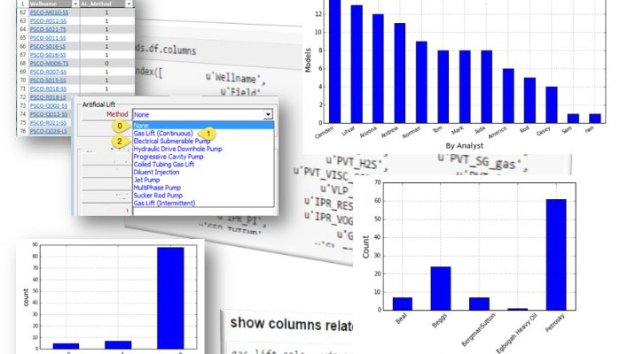
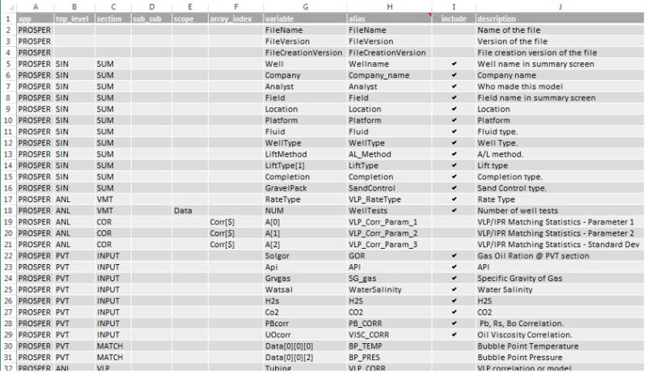
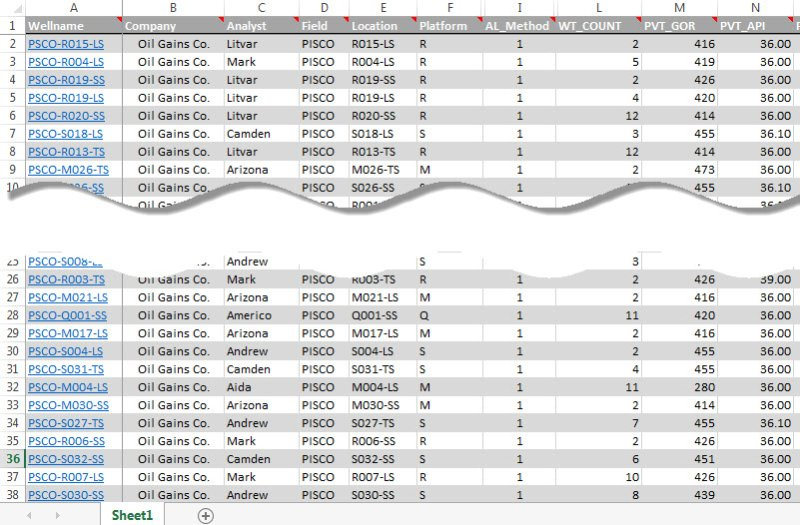
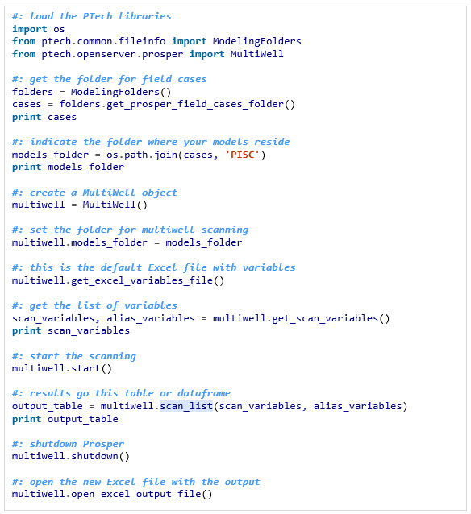
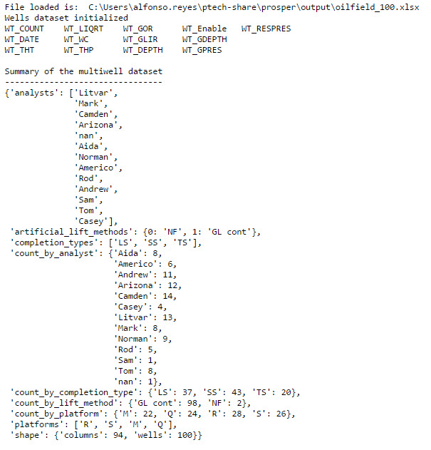
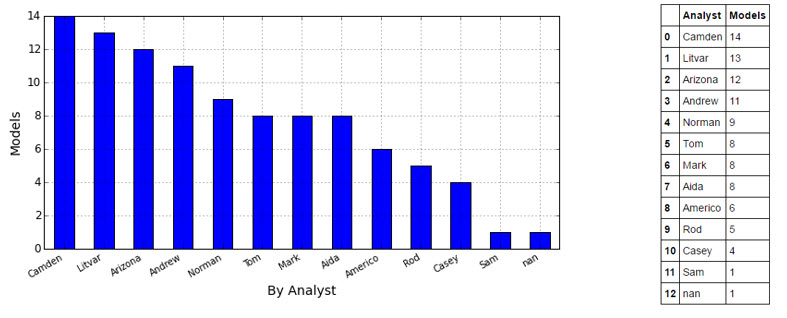
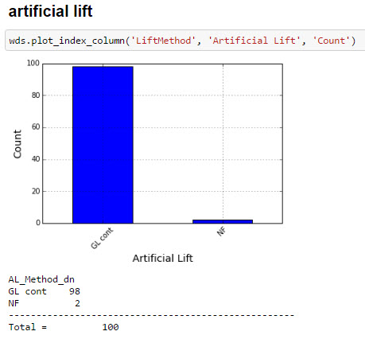
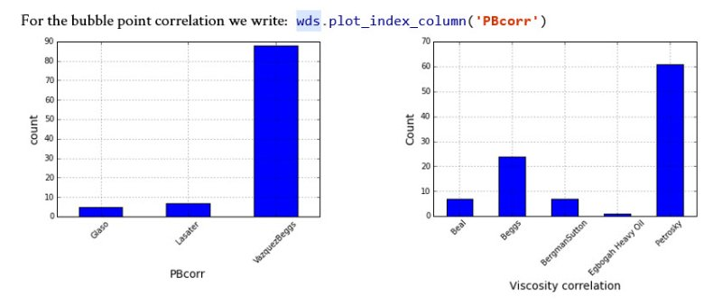

## Part 2: Data Science for Petroleum Production Engineering

In the past session we got an introduction to the multiwell statistics package showing a few of the things that we can do with the Petronas PTech Engineering Library. Now, we will explore some more functionality. It is incredible the huge amount of information when we get from all the wells in one scan pass. The data starts to have sense. A well in isolation or standalone doesn’t tell used much about the field or differences between well parameters from well to well. This is where the power of the multiwell scanning resides. 

The multiwell scanning is the process by which we use a Python script to automatically open all the well models in the background, pulling the user-defined parameters and create an output file where the rows are the wells and the well parameters are the columns. The scanning open the optimization software, which could be Petex Prosper, AppSmiths WinGLUE or any other that has a way to share its variables outside the application. In the case of Petronas, we adopted as a standard both. In this example I will use use Prosper. This is how a file with the input variables look like:

These are few of the variables that we want to pull from each of the well models to be scanned. Note that the first 7 columns belong to the decomposition of the Petex OpenServer variables. I created this input file to make possible a repeatable selection process. In one of the datasets we will see 94 variable-columns; in other maybe less than 40. You can also have a set of input workbooks; one for PVT analysis, another for well test, or gas lift, or IPR or VLP selection. In another post I will enter in detail about this input worksheet.

After the script finishes gathering data from the last well you will end up with an output file. The tabular form of the data in that output file is what is called in Python *pandas* a**dataframe**. The table looks like this:

Yes, it is Excel. But we just use it as a legacy so any production technologist can see the output without much complication. Some have questioned why we do all this data processing with Python instead of using Excel. The question is very simple, and I think you will quickly understand if you have ever worked with datasets in Excel. I will just cite few of the inconveniences: (1) the macros VBA are alright if you are writing less than a hundred of lines of code; (2) the code in VBA is difficult to maintain and there is no version control like with *git* or other; (3) Microsoft VBA has its own way of doing things and you have to learn a lot about the internals of the MS libraries if you want to do little above of the ordinary calculations and plotting; (4) VBA code is difficult to share with colleagues and when you make a change or update the code you have to send again the big workbook, in other words there is no updating process embedded within Excel and VBA. Don't get me wrong. I have done terrific things with Excel VBA but it is painful by the lack of an engineering or scientific community behind as is the case with Python. Let's say that Excel is good at table visualization and anybody can open and understand it.

But as you get immersed with Python and pandas you will see that using Excel as data containers is purely optional; there are other powerful data structures available out there.

The Python script that open the well models and pulls the data is this:

Each of the lines in the script is explained through a comment above. But let’s briefly explain what this script does. What we are trying to achieve is reading all the Prosper well models located under the folder PISC. You are interested in reading some variables from these models and putting them in a table-like structure for statistical analysis later. These variables have been defined in the input workbook –explained above. 

## Loading the dataset

Now, you have generated yourself a dataset. This dataset contains the data of 100 wells that was just generated by the application multiwell scanner. Let's load the dataset with this script:

Immediately with the execution we get some information about the well collection:

To star plotting, we can just write:

For artificial lift:

For the IPR methods that were used on each of the well models:

0

And for the PVT correlations:

## What are we learning so far?

At this moment you may be wondering: well modeling is hard; it takes a lot of work. So many variables to take care of. Yes, it is. That’s why getting a network model ready for scenarios and simulation takes so long. 
The advantage here, with the Python PTech Library, is that we are acting on multiple wells; not just one. There is a significant reduction in time and improvement in the quality of the data by tackling the problem in this way. But requires a toolbox: the toolbox of the data scientist. You are now using the bleeding edge of the digital tools available to the brightest minds in the world to find more oil; faster and efficiently.

